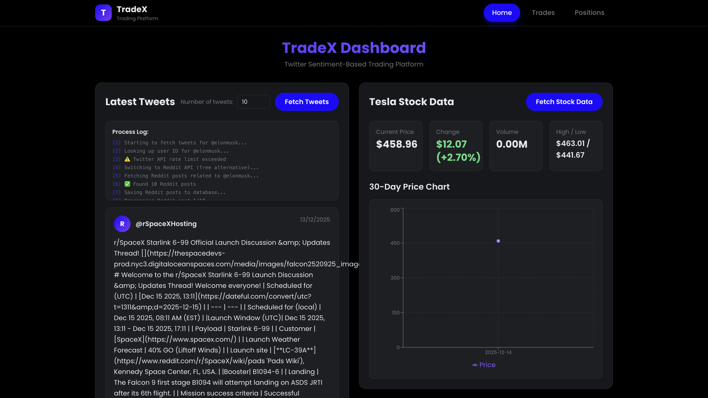
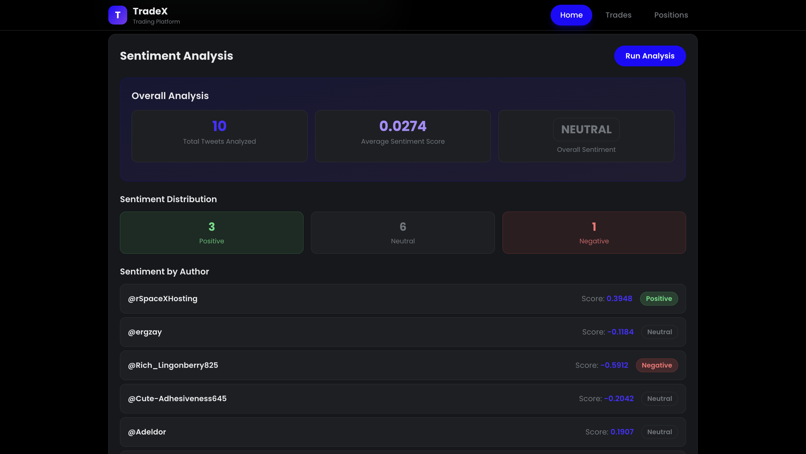

# TradeX - Twitter-Based Trading Bot

A full-stack trading application that analyzes social media sentiment (primarily Twitter) to make informed trading decisions. The system monitors tweets from influential accounts and uses advanced NLP techniques to determine market sentiment, which can then be used to execute trades.

## 🎯 Overview

TradeX is a production-ready trading bot that:
- Monitors tweets from key influencers (Elon Musk, Tesla, etc.)
- Performs real-time sentiment analysis using hybrid NLP models
- Makes automated trading decisions based on sentiment scores
- Provides a modern React dashboard for monitoring and control
- Includes comprehensive risk management and safety features

## 📸 Screenshots






## ✨ Features

### Core Functionality
- **Real-time Tweet Monitoring** - Continuous monitoring of Twitter accounts for new tweets
- **Hybrid Sentiment Analysis** - Combines VADER (rule-based) and RoBERTa (transformer-based) models for accurate sentiment detection
- **Automated Trading** - Integration with Alpaca API for paper trading and live trading
- **Risk Management** - Automatic position sizing and risk controls
- **Modern Dashboard** - React-based frontend for monitoring trades, positions, and sentiment

### Technical Features
- **Async Architecture** - Fully asynchronous backend using FastAPI
- **Production Ready** - Comprehensive logging, error handling, and Docker support
- **RESTful API** - Well-documented API with OpenAPI/Swagger documentation
- **Database Persistence** - PostgreSQL with SQLAlchemy ORM for data storage
- **Safety First** - Trading disabled by default, paper trading mode, configurable risk limits

## 🏗️ Architecture

### Technology Stack

**Backend:**
- **Framework**: FastAPI 0.115.0 (async Python web framework)
- **Database**: PostgreSQL with SQLAlchemy 2.0 (async ORM)
- **NLP Libraries**:
  - `vaderSentiment`: Rule-based sentiment analyzer optimized for social media
  - `transformers`: Hugging Face library with `cardiffnlp/twitter-roberta-base-sentiment-latest` model
- **APIs**: 
  - Tweepy 4.16.0 for Twitter API integration
  - Alpaca Trade API 3.1.1 for trading operations
- **Python**: 3.12+

**Frontend:**
- **Framework**: React 19 with TypeScript
- **Build Tool**: Vite
- **Styling**: Tailwind CSS
- **Charts**: Recharts for stock data visualization
- **HTTP Client**: Axios

### Project Structure

```
TradeX/
├── server/                 # Backend FastAPI application
│   ├── app/
│   │   ├── api/v1/        # API endpoints
│   │   ├── core/          # Configuration, logging, exceptions
│   │   ├── db/            # Database models and connection
│   │   ├── services/      # Business logic (Twitter, Sentiment, Trading)
│   │   └── utils/         # Helper functions
│   ├── main.py            # Application entry point
│   ├── requirements.txt   # Python dependencies
│   ├── Dockerfile         # Docker configuration
│   └── documentation/     # Detailed documentation
├── client/                 # Frontend React application
│   ├── src/
│   │   ├── components/    # React components
│   │   ├── pages/         # Page components
│   │   ├── services/      # API client
│   │   └── router/        # React Router setup
│   └── package.json       # Node dependencies
└── README.md              # This file
```

## 🚀 Quick Start

### Prerequisites

- Python 3.12+
- Node.js 18+ and npm
- PostgreSQL 14+
- Twitter API credentials (Bearer Token, API Key/Secret, Access Token/Secret)
- Alpaca API credentials (for trading)

### Backend Setup

1. **Navigate to server directory:**
   ```bash
   cd server
   ```

2. **Create virtual environment:**
   ```bash
   python -m venv venv
   source venv/bin/activate  # On Windows: venv\Scripts\activate
   ```

3. **Install dependencies:**
   ```bash
   pip install -r requirements.txt
   ```

4. **Configure environment variables:**
   ```bash
   cp .env.example .env
   # Edit .env with your credentials
   ```

   Required environment variables:
   - `TWITTER_BEARER_TOKEN` - Twitter API Bearer Token
   - `TWITTER_API_KEY` - Twitter API Key
   - `TWITTER_API_SECRET` - Twitter API Secret
   - `TWITTER_ACCESS_TOKEN` - Twitter Access Token
   - `TWITTER_ACCESS_TOKEN_SECRET` - Twitter Access Token Secret
   - `ALPACA_API_KEY` - Alpaca API Key
   - `ALPACA_API_SECRET` - Alpaca API Secret
   - `DATABASE_URL` - PostgreSQL connection string

5. **Set up PostgreSQL database:**
   ```bash
   # See server/documentation/setup/postgresql-setup.md for details
   ```

6. **Run the server:**
   ```bash
   python main.py
   # Or use the startup script
   ./run.sh
   ```

   The API will be available at:
   - **API Docs**: http://localhost:8000/api/docs
   - **ReDoc**: http://localhost:8000/api/redoc
   - **Health Check**: http://localhost:8000/health

### Frontend Setup

1. **Navigate to client directory:**
   ```bash
   cd client
   ```

2. **Install dependencies:**
   ```bash
   npm install
   ```

3. **Start development server:**
   ```bash
   npm run dev
   ```

   The app will be available at `http://localhost:5173`

### Docker Setup

```bash
# From server directory
docker-compose up -d
```

See [server/documentation/deployment/docker.md](server/documentation/deployment/docker.md) for detailed Docker instructions.

## 📚 Documentation

Comprehensive documentation is available in the `server/documentation/` directory:

- **[Quick Start Guide](server/documentation/getting-started/quick-start.md)** - Get up and running quickly
- **[PostgreSQL Setup](server/documentation/setup/postgresql-setup.md)** - Database setup instructions
- **[API Credentials Setup](server/documentation/setup/api-credentials.md)** - How to obtain and configure API keys
- **[API Reference](server/documentation/api-reference/endpoints.md)** - Complete API endpoint documentation
- **[Docker Deployment](server/documentation/deployment/docker.md)** - Production deployment guide

## 🔌 API Endpoints

### Health
- `GET /health` - Basic health check
- `GET /api/v1/health/detailed` - Detailed health with service status

### Tweets
- `GET /api/v1/tweets/` - Get all tweets (with pagination and filters)
- `GET /api/v1/tweets/{tweet_id}` - Get specific tweet
- `GET /api/v1/tweets/stats/summary` - Tweet statistics

### Trades
- `GET /api/v1/trades/` - Get all trades
- `GET /api/v1/trades/{trade_id}` - Get specific trade
- `GET /api/v1/trades/stats/summary` - Trade statistics
- `POST /api/v1/trades/execute` - Execute a trade

### Positions
- `GET /api/v1/positions/` - Get all positions
- `GET /api/v1/positions/{symbol}` - Get position for symbol

### Stocks
- `GET /api/v1/stocks/{symbol}` - Get stock information

## ⚙️ Configuration

Key configuration options in `server/.env`:

- `TRADING_ENABLED` - Enable/disable trading (safety: default `false`)
- `MAX_POSITION_SIZE` - Maximum position size in dollars
- `RISK_PERCENTAGE` - Risk percentage per trade
- `SENTIMENT_THRESHOLD_POSITIVE` - Positive sentiment threshold (default: 0.1)
- `SENTIMENT_THRESHOLD_NEGATIVE` - Negative sentiment threshold (default: -0.1)
- `MONITORED_USERS` - Comma-separated list of Twitter usernames
- `TWEET_CHECK_INTERVAL` - Interval in seconds to check for new tweets

## 🛡️ Safety Features

- **Trading disabled by default** - Set `TRADING_ENABLED=true` to enable
- **Paper trading** - Uses Alpaca paper trading by default
- **Position sizing** - Automatic risk management based on account size
- **Rate limiting** - Built-in rate limit handling for Twitter API
- **Error handling** - Comprehensive error handling and logging
- **Health monitoring** - Detailed health checks for all services

## 🔬 Sentiment Analysis

TradeX uses a hybrid approach combining two sentiment analysis methods:

1. **VADER (Valence Aware Dictionary and sEntiment Reasoner)**
   - Fast, rule-based analyzer optimized for social media
   - Good at detecting sarcasm and emojis
   - Weight: 40% in final score

2. **RoBERTa Transformer Model** (`cardiffnlp/twitter-roberta-base-sentiment-latest`)
   - Deep learning model specifically trained on Twitter data
   - More accurate for complex sentiment detection
   - Weight: 60% in final score

The final sentiment score is a weighted combination of both methods, providing both speed and accuracy.

## 🧪 Development

### Code Formatting

```bash
# Format Python code
black .

# Lint Python code
ruff check .
```

### Testing

```bash
# Run tests
pytest
```

## 📦 Production Deployment

1. Set `ENVIRONMENT=production` in `.env`
2. Set `DEBUG=false`
3. Use a production database (PostgreSQL recommended)
4. Set up proper logging and monitoring
5. Use a reverse proxy (nginx) in front of the application
6. Set up SSL/TLS certificates
7. Configure proper CORS origins

## 🤝 Contributing

This is an educational project. Contributions and improvements are welcome!

## ⚠️ Disclaimer

**This bot is for educational purposes only.** 

Trading stocks involves significant risk, and past performance does not guarantee future results. The sentiment analysis and trading decisions made by this bot are not financial advice. Always:

- Do your own research
- Understand the risks involved
- Start with paper trading
- Consider consulting with a financial advisor
- Never invest more than you can afford to lose

The authors and contributors are not responsible for any financial losses incurred from using this software.

## 📄 License

See LICENSE file for details.

---

**Built with ❤️ for learning and experimentation**
